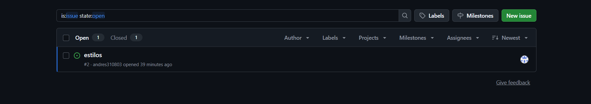
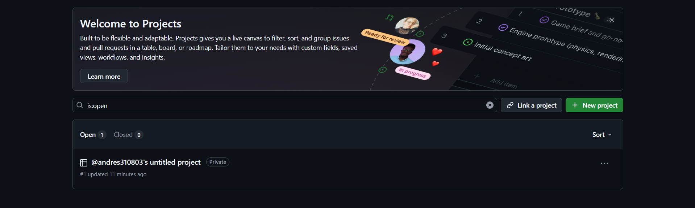
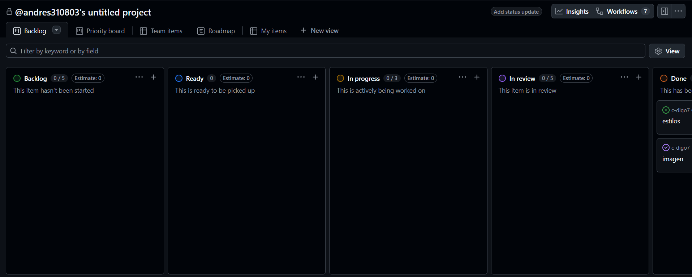

# 📚 Práctica de GitHub

## 🚀 Lo aprendido en clase

Durante la sesión de hoy aprendimos sobre algunas de las herramientas más importantes que ofrece **GitHub** para el trabajo colaborativo. Estas funciones permiten organizar tareas, administrar proyectos y facilitar la comunicación entre los miembros de un equipo.

---

## 📝 1. Issues en GitHub

Los **Issues** son reportes o tareas que ayudan a dar seguimiento a problemas, mejoras o nuevas funcionalidades dentro de un repositorio.

### Algunas de sus ventajas son:

- ✅ Registrar errores encontrados.
- ✅ Proponer nuevas características.
- ✅ Asignar responsables.
- ✅ Dar seguimiento al progreso.

> *Los Issues son una excelente forma de mantener organizado el desarrollo de un proyecto.*

---

## 📂 2. Proyectos (Projects)

También conocimos los **GitHub Projects**, que funcionan como tableros para organizar el trabajo mediante columnas y tarjetas.

Permiten:

- 📌 Planificar tareas.
- 📌 Organizar actividades pendientes.
- 📌 Visualizar el avance del proyecto.
- 📌 Gestionar flujos de trabajo de manera sencilla.

**Una buena organización mejora la productividad del equipo.**

---

## 👥 3. Colaboradores

Finalmente aprendimos cómo agregar **colaboradores** a un repositorio para que varias personas puedan trabajar en el mismo proyecto.

Los colaboradores pueden:

1. Realizar cambios en el código.
2. Crear ramas (*branches*).
3. Enviar *Pull Requests*.
4. Participar en el desarrollo conjunto.

> **Trabajar en equipo** es una de las principales fortalezas de GitHub.

---

## 🎯 Conclusión

En conclusión, durante esta práctica comprendimos la importancia de utilizar:

- **Issues** para gestionar tareas y problemas.
- **Projects** para organizar el flujo de trabajo.
- **Colaboradores** para facilitar el desarrollo en equipo.

*Estas herramientas hacen que el trabajo colaborativo sea mucho más eficiente y organizado.*